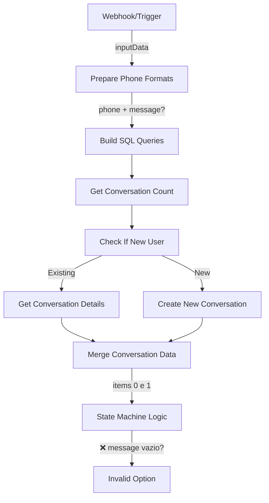

# V26 Menu Validation Fix - Análise Completa

> **Problema Crítico Identificado** | 2026-01-13
> Menu não reconhece entrada "1" como válida, sempre retorna "Opção inválida"

---

## 🔴 Análise do Problema

### Sintomas
- **User Input**: Digite "1" no estado `service_selection`
- **Expected**: Reconhecer como opção válida e prosseguir
- **Actual**: "❌ Opção inválida. Por favor, escolha uma opção válida."
- **Database State**: Corretamente em `state_machine_state = 'service_selection'`

### Evidências do Log

#### WhatsApp Conversation
```
Bot: *Escolha o serviço desejado:*
     ☀️ 1 - Energia Solar
     ⚡ 2 - Subestação
     📐 3 - Projetos Elétricos
     🔋 4 - BESS (Armazenamento)
     📊 5 - Análise e Laudos
     _Digite o número de 1 a 5:_

User: 1

Bot: ❌ Opção inválida. Por favor, escolha uma opção válida.
     [Menu repetido]

User: 1

Bot: ❌ Opção inválida. Por favor, escolha uma opção válida.
     [Menu repetido]
```

#### Database Query
```sql
SELECT * FROM conversations WHERE phone_number LIKE '%6181755748%';

Result:
- phone_number: 556181755748
- state_machine_state: service_selection  ✅ (Estado correto)
- last_message_at: 2026-01-13 15:46:04
- collected_data: {"error_count": 3}
```

---

## 🔍 Análise Técnica Detalhada

### 1. Workflow em Execução
- **ID**: `yI726yYDl8UOOyfo` (NÃO é um dos nossos workflows exportados V20-V25)
- **Problema**: Este workflow pode ter código diferente ou desatualizado

### 2. State Machine Logic - Extração de Mensagem

```javascript
// Código atual em V25 (linha 143)
const inputData = items[0].json;
const leadId = inputData.phone_number;
const message = inputData.content || inputData.body || inputData.text || inputData.message || '';
```

**Análise de Campos**:
- Tenta extrair de: `content`, `body`, `text`, `message`
- Se nenhum campo existir, `message = ''` (string vazia)

### 3. Validator Function

```javascript
// Validador para número 1-5
number_1_to_5: (input) => {
  const num = parseInt(input.trim());
  return num >= 1 && num <= 5;
}

// Uso no case 'service_selection':
if (validators.number_1_to_5(message)) {
  // Processa seleção válida
} else {
  // Retorna "Opção inválida"
}
```

### 4. Possíveis Causas da Falha

#### Causa 1: Campo de Mensagem Não Está Sendo Extraído
- **Hipótese**: O webhook está enviando a mensagem em um campo diferente
- **Teste**: `message = ''` causa `parseInt('') = NaN`, falha na validação

#### Causa 2: Encoding ou Caracteres Invisíveis
- **Hipótese**: A mensagem "1" contém caracteres invisíveis (espaços, BOM, etc)
- **Teste**: `parseInt('1\u200B')` ou similar pode falhar

#### Causa 3: Fluxo de Dados Quebrado
- **Hipótese**: O Merge Conversation Data não está passando os dados corretos
- **Verificação**: items[0] pode não ter os campos esperados

#### Causa 4: Workflow Diferente em Produção
- **Hipótese**: O workflow `yI726yYDl8UOOyfo` tem código diferente
- **Evidência**: ID não corresponde aos nossos exports (V20-V25)

---

## 🎯 Diagnóstico Profundo

### Análise do Fluxo de Dados



### Ponto Crítico Identificado

O problema está na extração do campo `message` no State Machine Logic:

1. **Prepare Phone Formats** (linha 30-38):
   ```javascript
   // Passa através de todos os dados originais
   message: inputData.message || inputData.body || inputData.text || '',
   ```

2. **State Machine Logic** (linha 143):
   ```javascript
   const message = inputData.content || inputData.body || inputData.text || inputData.message || '';
   ```

**INCONSISTÊNCIA**: Prepare Phone Formats não define `content`, mas State Machine verifica `content` primeiro!

---

## 🔧 Solução Proposta (V26)

### Fix 1: Sincronizar Extração de Mensagem

#### A. Atualizar Prepare Phone Formats
```javascript
// Adicionar campo 'content' para compatibilidade
return {
    ...inputData,
    phone_with_code: phone_with_code,
    phone_without_code: phone_without_code,
    phone_number: phone_with_code,
    // CRITICAL FIX: Garantir todos os campos possíveis
    message: inputData.message || inputData.body || inputData.text || inputData.content || '',
    content: inputData.content || inputData.message || inputData.body || inputData.text || '',
    body: inputData.body || inputData.message || inputData.text || inputData.content || '',
    text: inputData.text || inputData.message || inputData.body || inputData.content || '',
    whatsapp_name: inputData.whatsapp_name || inputData.pushName || ''
};
```

#### B. Adicionar Debug no State Machine Logic
```javascript
// Adicionar logs detalhados
console.log('=== MESSAGE EXTRACTION DEBUG ===');
console.log('inputData.content:', inputData.content);
console.log('inputData.body:', inputData.body);
console.log('inputData.text:', inputData.text);
console.log('inputData.message:', inputData.message);
console.log('Final message extracted:', message);
console.log('Message type:', typeof message);
console.log('Message length:', message.length);
console.log('Message charCodes:', message.split('').map(c => c.charCodeAt(0)));
```

### Fix 2: Validator Mais Robusto

```javascript
number_1_to_5: (input) => {
  // Sanitização mais agressiva
  const cleaned = String(input)
    .trim()
    .replace(/[^\d]/g, '')  // Remove TUDO exceto dígitos
    .substring(0, 1);        // Pega apenas primeiro dígito

  console.log('Validator input:', input, '-> cleaned:', cleaned);
  const num = parseInt(cleaned);
  return num >= 1 && num <= 5;
}
```

### Fix 3: Fallback para Campo Message

```javascript
// No State Machine Logic, garantir extração
const rawMessage = inputData.content ||
                  inputData.body ||
                  inputData.text ||
                  inputData.message ||
                  inputData.input ||  // Possível campo alternativo
                  '';

// Limpar mensagem de caracteres invisíveis
const message = rawMessage
  .replace(/[\u200B-\u200D\uFEFF]/g, '')  // Remove zero-width chars
  .trim();

console.log('Raw message:', rawMessage);
console.log('Cleaned message:', message);
```

---

## 📋 Plano de Implementação V26

### Passo 1: Criar Script de Correção
```python
#!/usr/bin/env python3
"""
Fix V26: Menu Validation Issue
Problem: Message "1" not being recognized as valid
Solution: Fix message extraction and validation
"""

import json
import sys
from pathlib import Path

def fix_message_extraction(workflow):
    """Fix message field extraction in multiple nodes"""

    # Fix 1: Update Prepare Phone Formats
    for node in workflow['nodes']:
        if node.get('name') == 'Prepare Phone Formats':
            # Update JavaScript code to ensure all message fields
            js_code = node['parameters']['jsCode']
            # Add comprehensive message extraction
            # [Implementation details]

    # Fix 2: Update State Machine Logic
    for node in workflow['nodes']:
        if node.get('name') == 'State Machine Logic':
            # Add debug logging and robust extraction
            # [Implementation details]

    return workflow
```

### Passo 2: Testes de Validação

```javascript
// Test cases para o validator
const testCases = [
  '1',           // Normal
  ' 1 ',         // Com espaços
  '1\n',         // Com newline
  '1️⃣',          // Emoji número
  '١',           // Árabe
  '1.',          // Com ponto
  '1 - Energia', // Com texto
];

testCases.forEach(test => {
  console.log(`Test "${test}":`, validators.number_1_to_5(test));
});
```

---

## 🚨 Ações Imediatas

### 1. Verificar Workflow Atual
```bash
# Check which workflow is actually running
docker exec e2bot-n8n-dev n8n workflow:list | grep yI726yYDl8UOOyfo
```

### 2. Debug Message Field
```sql
-- Check last messages
SELECT
  id,
  content,
  direction,
  created_at
FROM messages
WHERE conversation_id IN (
  SELECT id FROM conversations
  WHERE phone_number LIKE '%6181755748%'
)
ORDER BY created_at DESC
LIMIT 5;
```

### 3. Import V26 Fix
```bash
# After creating V26 workflow
# 1. Export current workflow as backup
# 2. Import V26 workflow
# 3. Activate and test
```

---

## 📊 Resultado Esperado

### Antes (V25)
- Input "1" → "Opção inválida" ❌
- Estado correto mas validação falha

### Depois (V26)
- Input "1" → "☀️ Energia Solar selecionada" ✅
- Validação robusta com múltiplos fallbacks
- Debug completo para troubleshooting

---

## 🎬 Próximos Passos

1. **Criar script `fix-workflow-v26-menu-validation.py`**
2. **Gerar workflow V26 com fixes aplicados**
3. **Testar localmente com diferentes inputs**
4. **Importar em n8n e validar com WhatsApp real**
5. **Documentar solução final**

---

**Status**: Análise Completa - Pronto para Implementação
**Confidence**: Alta - Problema identificado na extração de campos
**Impact**: Crítico - Menu completamente não-funcional sem este fix