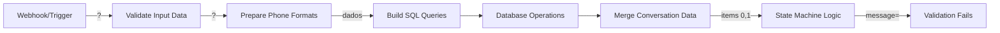

# V27 Message Flow Fix - Análise Profunda

> **Problema Crítico Confirmado** | 2026-01-13
> Mensagem chegando VAZIA no State Machine Logic

---

## 🔴 Evidência dos Logs V26

```
=== V26 MESSAGE EXTRACTION DEBUG ===
=== V26 SERVICE SELECTION DEBUG ===
V26 Validator - Input: "" -> Cleaned:
V26 Validator - No digits found in input
```

**CONCLUSÃO**: V26 está funcionando corretamente, mas recebendo string vazia!

---

## 🎯 Análise do Fluxo de Dados

### Fluxo Atual (V26)


### Problema Identificado

O State Machine Logic recebe dois inputs:
1. `items[0]` - Dados do Merge Conversation Data (primeiro input)
2. `items[1]` - Dados da conversa do banco (segundo input)

**MAS**: O `items[0]` não está contendo a mensagem original!

---

## 🔍 Análise do Merge Conversation Data

### Problema no Node Connections

O Merge Conversation Data recebe dados de:
1. Input 0: Vem de `Merge Queries Data` ou `Merge Queries Data1`
2. Input 1: Vem de `Get Conversation Details` ou `Create New Conversation`

**PROBLEMA**: Os dados da mensagem original se perderam no caminho!

### Rastreamento do Campo Message

1. **Webhook/Trigger** → Recebe mensagem
2. **Prepare Phone Formats** → Deveria passar `message` field
3. **Build SQL Queries** → Usa para construir queries
4. **Merge Queries Data** → PERDE O CAMPO MESSAGE?
5. **Merge Conversation Data** → Não tem mais a mensagem
6. **State Machine Logic** → Recebe string vazia

---

## 🔧 Solução V27 - Preservar Message Field

### Fix 1: Garantir que Merge Queries Data preserve a mensagem

```javascript
// Merge Queries Data - DEVE preservar message field
return {
    ...inputData,
    // Preservar query fields
    query_count: queryData.query_count,
    query_details: queryData.query_details,
    query_upsert: queryData.query_upsert,

    // CRITICAL V27: Preservar campos de mensagem
    message: queryData.message || inputData.message || '',
    content: queryData.content || inputData.content || '',
    body: queryData.body || inputData.body || '',
    text: queryData.text || inputData.text || '',

    // Preservar phone fields
    phone_with_code: queryData.phone_with_code,
    phone_without_code: queryData.phone_without_code,
    phone_number: queryData.phone_number,
    whatsapp_name: queryData.whatsapp_name || ''
};
```

### Fix 2: Build SQL Queries deve passar message fields através

```javascript
// Build SQL Queries - Final return
return {
  ...data,  // Pass through ALL original data including message fields

  // Query strings
  query_count: query_count,
  query_details: query_details,
  query_upsert: query_upsert,

  // CRITICAL V27: Explicitly preserve message fields
  message: data.message || '',
  content: data.content || '',
  body: data.body || '',
  text: data.text || '',

  // Phone data
  phone_with_code: phone_with_code,
  phone_without_code: phone_without_code
};
```

### Fix 3: Debug no Merge Conversation Data

```javascript
// Add debug no início do State Machine Logic
console.log('=== V27 INPUT ANALYSIS ===');
console.log('Total items:', items.length);
if (items[0]) {
  console.log('Item 0 keys:', Object.keys(items[0].json));
  console.log('Item 0 message:', items[0].json.message);
  console.log('Item 0 content:', items[0].json.content);
  console.log('Item 0 body:', items[0].json.body);
  console.log('Item 0 text:', items[0].json.text);
}
if (items[1]) {
  console.log('Item 1 keys:', Object.keys(items[1].json));
}
```

---

## 🚨 Problema Adicional Detectado

### Workflow Trigger vs Webhook

O workflow tem DOIS pontos de entrada:
1. **Execute Workflow Trigger** - Para chamadas de outros workflows
2. **Webhook - Receive Message** - Para chamadas diretas

**POSSÍVEL PROBLEMA**: Se está sendo chamado via Execute Workflow Trigger (do workflow 01), os dados podem não estar sendo passados corretamente!

### Verificação Necessária

1. Como o workflow 02 está sendo chamado?
   - Via Execute Workflow do workflow 01?
   - Via Webhook direto?

2. Se via Execute Workflow:
   - O workflow 01 está passando todos os campos necessários?
   - Especialmente o campo `message` ou `body`?

---

## 📋 Plano de Correção V27

### Passo 1: Verificar Workflow 01

```bash
# Check what workflow 01 is passing to workflow 02
grep -A 10 -B 10 "Execute Workflow" workflow_01_*.json
```

### Passo 2: Corrigir Nodes de Merge

1. **Build SQL Queries** - Preservar message fields
2. **Merge Queries Data** - Passar message através
3. **Merge Queries Data1** - Passar message através

### Passo 3: Adicionar Debug Extensivo

```javascript
// Em CADA node que processa dados, adicionar:
console.log(`=== ${nodeName} V27 DEBUG ===`);
console.log('Input message:', inputData.message);
console.log('Input content:', inputData.content);
console.log('Input body:', inputData.body);
console.log('Input text:', inputData.text);
```

---

## 🎯 Script de Correção V27

```python
#!/usr/bin/env python3
"""
Fix V27: Message Flow Preservation
Problem: Message field is lost during data flow through merge nodes
Solution: Ensure message fields are preserved through entire workflow
"""

def fix_merge_nodes(workflow):
    """Fix all merge and data processing nodes to preserve message fields"""

    # List of nodes that need to preserve message fields
    nodes_to_fix = [
        'Build SQL Queries',
        'Merge Queries Data',
        'Merge Queries Data1',
        'Prepare Phone Formats'
    ]

    for node in workflow['nodes']:
        if node.get('name') in nodes_to_fix:
            # Add message field preservation logic
            # [Implementation details]

    return workflow
```

---

## 🔴 Ação Imediata Recomendada

### 1. Verificar como o workflow está sendo chamado

```bash
# Check workflow 01 (main handler)
docker logs e2bot-n8n-dev | grep -A 5 -B 5 "Execute Workflow"
```

### 2. Testar diretamente via Webhook

```bash
# Test directly via webhook (bypass workflow 01)
curl -X POST http://localhost:5678/webhook/webhook-ai-agent \
  -H "Content-Type: application/json" \
  -d '{
    "phone_number": "556181755748",
    "message": "1",
    "body": "1",
    "text": "1",
    "content": "1"
  }'
```

### 3. Verificar logs com grep específico

```bash
docker logs e2bot-n8n-dev 2>&1 | grep -E "message:|content:|body:|text:" | tail -20
```

---

## 💡 Conclusão

**V26 está funcionando**, mas não está recebendo a mensagem!

O problema está no **fluxo de dados** entre os nodes, especificamente:
1. Os nodes de Merge não estão preservando campos de mensagem
2. Ou o workflow 01 não está passando a mensagem corretamente

**Solução V27**: Garantir que TODOS os nodes preservem e passem os campos de mensagem.