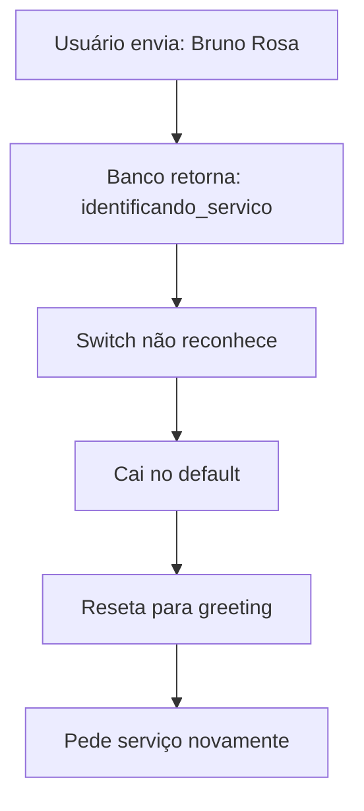

# V32 - Plano de Correção: State Mapping e Validação de Telefone

## 🚨 PROBLEMAS IDENTIFICADOS

### 1. MAPEAMENTO DE ESTADOS INCONSISTENTE
**Gravidade**: CRÍTICA 🔴

#### Análise do Bug
```
BANCO DE DADOS está enviando:
- current_state: "identificando_servico"

CÓDIGO está esperando:
- case 'service_selection'

RESULTADO:
- Estado não reconhecido → Cai no default → Reseta conversa
```

#### Fluxo Atual do Erro


### 2. TELEFONE NÃO ESTÁ SENDO VALIDADO
**Gravidade**: MÉDIA 🟡

- Não confirma se o telefone principal é o mesmo do WhatsApp
- Não oferece opção de alterar telefone
- Perde oportunidade de coletar telefone alternativo

## 📋 PLANO DE CORREÇÃO V32

### ETAPA 1: CRIAR MAPEAMENTO DE ESTADOS
```javascript
// V32: State Name Mapping (Database → Code)
const stateNameMapping = {
  // Mapeamento dos nomes do banco para nomes do código
  'identificando_servico': 'service_selection',
  'service_selection': 'service_selection',
  'coletando_nome': 'collect_name',
  'collect_name': 'collect_name',
  'coletando_telefone': 'collect_phone',
  'collect_phone': 'collect_phone',
  'coletando_email': 'collect_email',
  'collect_email': 'collect_email',
  'coletando_cidade': 'collect_city',
  'collect_city': 'collect_city',
  'confirmacao': 'confirmation',
  'confirmation': 'confirmation',
  'agendamento': 'scheduling',
  'scheduling': 'scheduling',
  'transferencia_comercial': 'handoff_comercial',
  'handoff_comercial': 'handoff_comercial',
  'finalizado': 'completed',
  'completed': 'completed',
  'greeting': 'greeting',
  'saudacao': 'greeting'
};
```

### ETAPA 2: NORMALIZAR ESTADO ANTES DO SWITCH
```javascript
// Get current state and normalize it
const rawCurrentStage = conversation.state_machine_state ||
                        conversation.state_for_machine ||
                        conversation.current_state ||
                        'greeting';

// V32: NORMALIZE STATE NAME
const currentStage = stateNameMapping[rawCurrentStage] || rawCurrentStage;

console.log('V32 STATE NORMALIZATION:');
console.log('Raw state from DB:', rawCurrentStage);
console.log('Normalized state:', currentStage);
```

### ETAPA 3: ADICIONAR VALIDAÇÃO DE TELEFONE
```javascript
case 'collect_phone':
  console.log('=== V32 PHONE VALIDATION ===');

  // Get WhatsApp number (the one they're messaging from)
  const whatsappNumber = leadId.replace(/\D/g, '');
  const inputNumber = message.replace(/\D/g, '');

  console.log('WhatsApp number:', whatsappNumber);
  console.log('Input number:', inputNumber);

  // Check if it's a confirmation request
  if (message.toLowerCase().includes('sim') || message === '1') {
    // User confirmed same number
    const formatted = whatsappNumber.replace(/(\d{2})(\d{4,5})(\d{4})/, '($1) $2-$3');
    updateData.phone = formatted;
    updateData.phone_whatsapp = formatted;
    updateData.phone_alternative = null;

    responseText = templates.collect_email.text;
    nextStage = 'collect_email';
    errorCount = 0;

  } else if (validators.phone_brazil(message)) {
    // User provided a different number
    const cleaned = message.replace(/\D/g, '');
    const formatted = cleaned.replace(/(\d{2})(\d{4,5})(\d{4})/, '($1) $2-$3');
    const whatsappFormatted = whatsappNumber.replace(/(\d{2})(\d{4,5})(\d{4})/, '($1) $2-$3');

    updateData.phone = formatted;  // Main phone
    updateData.phone_whatsapp = whatsappFormatted;  // WhatsApp phone
    updateData.phone_alternative = formatted;  // Alternative provided

    responseText = templates.collect_email.text;
    nextStage = 'collect_email';
    errorCount = 0;

  } else if (!stageData.phone_confirmation_asked) {
    // First time in this stage - ask for confirmation
    const formatted = whatsappNumber.replace(/(\d{2})(\d{4,5})(\d{4})/, '($1) $2-$3');

    responseText = `📱 Percebi que você está usando o WhatsApp do número:\n*${formatted}*\n\nEste é seu telefone principal?\n\n✅ Digite *1* ou *SIM* para confirmar\n📝 Ou digite outro número com DDD`;

    updateData.phone_confirmation_asked = true;
    nextStage = 'collect_phone';  // Stay in same stage

  } else {
    // Validation failed
    responseText = templates.invalid_phone.text;
    nextStage = 'collect_phone';
    errorCount++;

    if (errorCount >= MAX_ERRORS) {
      nextStage = 'handoff_comercial';
      responseText = '⚠️ Vou transferir você para um especialista.\n\nAguarde...';
    }
  }
  break;
```

### ETAPA 4: ATUALIZAR TEMPLATE DE CONFIRMAÇÃO
```javascript
confirmation: {
  template: '✅ *Dados confirmados!*\n\n' +
    '👤 *Nome:* {{lead_name}}\n' +
    '📱 *Telefone Principal:* {{phone}}\n' +
    '📲 *WhatsApp:* {{phone_whatsapp}}\n' +  // Novo campo
    '📧 *Email:* {{email}}\n' +
    '📍 *Cidade:* {{city}}\n' +
    '{{emoji}} *Serviço:* {{service_name}}\n\n' +
    '━━━━━━━━━━━━━━━\n\n' +
    '🗓️ Deseja agendar uma *visita técnica gratuita*?\n\n' +
    '1️⃣ Sim, quero agendar\n' +
    '2️⃣ Não, prefiro falar com especialista\n\n' +
    '_Digite 1 ou 2:_'
}
```

## 🎯 AÇÕES PARA O /sc:task EXECUTAR

### TAREFA 1: Implementar State Mapping
**Prioridade**: CRÍTICA 🔴
```
1. Adicionar objeto stateNameMapping no início do código
2. Normalizar currentStage antes do switch
3. Adicionar logs V32 para debug
4. Testar todos os estados possíveis
```

### TAREFA 2: Implementar Validação de Telefone
**Prioridade**: ALTA 🟡
```
1. Modificar case 'collect_phone' com nova lógica
2. Adicionar campos phone_whatsapp e phone_alternative
3. Criar fluxo de confirmação do número
4. Atualizar template de confirmação
```

### TAREFA 3: Criar Script de Correção
**Prioridade**: ALTA 🟡
```
1. Criar fix-workflow-v32-state-mapping.py
2. Aplicar todas as correções V32
3. Gerar workflow JSON corrigido
4. Criar script de validação
```

### TAREFA 4: Testar Cenários
**Prioridade**: MÉDIA 🟢
```
1. Testar estado "identificando_servico"
2. Testar confirmação de telefone (SIM)
3. Testar telefone diferente
4. Testar fluxo completo
```

## 📊 RESULTADO ESPERADO

### Antes (V31):
```
User: "1" (escolhe serviço)
Bot: "Qual seu nome?"
User: "Bruno Rosa"
Bot: "Escolha o serviço:" ❌ (ERRO - volta ao menu)
```

### Depois (V32):
```
User: "1" (escolhe serviço)
Bot: "Qual seu nome?"
User: "Bruno Rosa"
Bot: "Seu WhatsApp é (62) 98175-5548. É seu telefone principal?" ✅
User: "sim"
Bot: "Qual seu email?"
```

## 🔧 COMANDO PARA EXECUÇÃO

```bash
# Para o /sc:task executar:
/sc:task implement "V32 State Mapping Fix" \
  --file n8n/workflows/02_ai_agent_conversation_V32_STATE_MAPPING.json \
  --priority critical \
  --test-scenarios 4 \
  --validate-before-deploy
```

## ⚠️ AVISOS IMPORTANTES

1. **NÃO EXECUTAR** sem revisar o mapeamento de estados
2. **TESTAR** em ambiente dev primeiro
3. **VALIDAR** que o banco está salvando os estados corretamente
4. **BACKUP** do workflow V31 antes de aplicar V32

## 📝 CHECKLIST DE VALIDAÇÃO

- [ ] State mapping implementado
- [ ] Normalização funcionando
- [ ] Telefone sendo validado
- [ ] WhatsApp e telefone principal diferenciados
- [ ] Templates atualizados
- [ ] Logs V32 ativos
- [ ] Testes passando
- [ ] Documentação atualizada

---

**Status**: PRONTO PARA REVISÃO
**Versão**: V32
**Data**: 2025-01-16
**Autor**: Claude Code Assistant