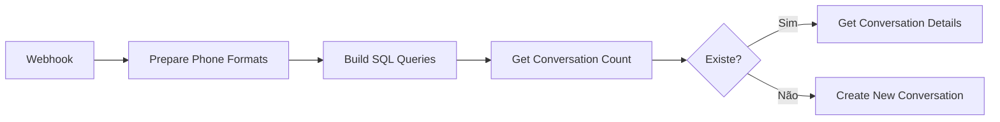

# Solução: Query PostgreSQL sem JavaScript no n8n

## 🎯 Problema Identificado
O n8n não está processando corretamente a interpolação de variáveis JavaScript dentro das queries SQL do PostgreSQL. A sintaxe `{{ $node["nome"].json.campo }}` não está funcionando adequadamente.

### Erro Específico
```sql
-- ❌ Query problemática
SELECT COUNT(*) as count
FROM conversations
WHERE phone_number IN (
  '{{ $node["Prepare Phone Formats"].json.phone_with_code }}',
  '{{ $node["Prepare Phone Formats"].json.phone_without_code }}'
);
```

## ✅ Solução Proposta

### Abordagem 1: Usar Parâmetros de Query (RECOMENDADA)

#### 1.1. Configuração no Node PostgreSQL
Em vez de interpolar valores diretamente na query, usar parâmetros de query do PostgreSQL:

```json
{
  "node": "PostgreSQL",
  "parameters": {
    "operation": "executeQuery",
    "query": "SELECT COUNT(*) as count FROM conversations WHERE phone_number = $1 OR phone_number = $2",
    "additionalFields": {
      "queryParams": "={{$json.phone_with_code}},={{$json.phone_without_code}}"
    }
  }
}
```

### Abordagem 2: Usar Node Set para Preparar Query

#### 2.1. Adicionar Node "Set" antes do PostgreSQL
```json
{
  "node": "Set",
  "name": "Prepare SQL Query",
  "parameters": {
    "keepOnlySet": false,
    "values": {
      "string": [
        {
          "name": "query",
          "value": "=SELECT COUNT(*) as count FROM conversations WHERE phone_number IN ('{{$json.phone_with_code}}', '{{$json.phone_without_code}}')"
        }
      ]
    }
  }
}
```

#### 2.2. No Node PostgreSQL, usar:
```json
{
  "query": "={{$json.query}}"
}
```

### Abordagem 3: Usar Function Node com Query Preparada

#### 3.1. Adicionar Function Node
```javascript
// Node: Prepare Query
const phone_with_code = $input.first().json.phone_with_code;
const phone_without_code = $input.first().json.phone_without_code;

// Criar query SQL segura
const query = `
  SELECT COUNT(*) as count
  FROM conversations
  WHERE phone_number IN ('${phone_with_code}', '${phone_without_code}')
`;

return {
  query: query,
  phone_with_code: phone_with_code,
  phone_without_code: phone_without_code
};
```

#### 3.2. No Node PostgreSQL
```json
{
  "query": "={{$json.query}}"
}
```

## 🔧 Implementação Detalhada

### Passo 1: Modificar o Node "Prepare Phone Formats"
Manter como está, apenas garantir que retorna:
```javascript
return {
  phone_with_code: phone_with_code,      // ex: "556181755748"
  phone_without_code: phone_without_code, // ex: "6181755748"
  // ... outros campos
};
```

### Passo 2: Adicionar Node "Build SQL Queries"
**Tipo:** Code (Function)
**Nome:** Build SQL Queries
**Posição:** Entre "Prepare Phone Formats" e "Get Conversation Count"

```javascript
// Recebe dados do node anterior
const data = $input.first().json;
const phone_with_code = data.phone_with_code || '';
const phone_without_code = data.phone_without_code || '';

// Validação de segurança
if (!phone_with_code || !phone_without_code) {
  throw new Error('Phone numbers not properly formatted');
}

// Escape simples para SQL injection
const escapeSql = (str) => {
  return String(str).replace(/'/g, "''");
};

// Construir queries SQL
const queries = {
  // Query para contar conversas existentes
  count: `
    SELECT COUNT(*) as count
    FROM conversations
    WHERE phone_number IN ('${escapeSql(phone_with_code)}', '${escapeSql(phone_without_code)}')
  `,

  // Query para buscar detalhes da conversa
  details: `
    SELECT
      *,
      COALESCE(state_machine_state,
        CASE current_state
          WHEN 'novo' THEN 'greeting'
          WHEN 'identificando_servico' THEN 'service_selection'
          WHEN 'coletando_dados' THEN 'collect_name'
          WHEN 'agendando' THEN 'scheduling'
          WHEN 'handoff_comercial' THEN 'handoff_comercial'
          WHEN 'concluido' THEN 'completed'
          ELSE 'greeting'
        END
      ) as state_for_machine
    FROM conversations
    WHERE phone_number IN ('${escapeSql(phone_with_code)}', '${escapeSql(phone_without_code)}')
    ORDER BY updated_at DESC
    LIMIT 1
  `,

  // Query para criar/atualizar conversa
  upsert: `
    -- Limpar duplicatas antigas
    DELETE FROM conversations
    WHERE phone_number = '${escapeSql(phone_without_code)}'
      AND phone_number != '${escapeSql(phone_with_code)}';

    -- Inserir ou atualizar
    INSERT INTO conversations (
      phone_number,
      whatsapp_name,
      current_state,
      state_machine_state,
      created_at,
      updated_at
    )
    VALUES (
      '${escapeSql(phone_with_code)}',
      '${escapeSql(data.whatsapp_name || '')}',
      'novo',
      'greeting',
      NOW(),
      NOW()
    )
    ON CONFLICT (phone_number)
    DO UPDATE SET
      whatsapp_name = EXCLUDED.whatsapp_name,
      updated_at = NOW(),
      current_state = CASE
        WHEN conversations.current_state = 'concluido' THEN 'novo'
        ELSE conversations.current_state
      END,
      state_machine_state = CASE
        WHEN conversations.state_machine_state = 'completed' THEN 'greeting'
        ELSE conversations.state_machine_state
      END
    RETURNING *
  `
};

// Retornar dados + queries
return {
  ...data,
  queries: queries,
  query_count: queries.count,
  query_details: queries.details,
  query_upsert: queries.upsert
};
```

### Passo 3: Modificar Node "Get Conversation Count"
**No campo Query, usar simplesmente:**
```
={{$json.query_count}}
```

### Passo 4: Modificar Node "Get Conversation Details"
**No campo Query, usar:**
```
={{$json.query_details}}
```

### Passo 5: Modificar Node "Create New Conversation"
**No campo Query, usar:**
```
={{$json.query_upsert}}
```

## 🚀 Fluxo de Execução



## 💡 Vantagens da Solução

1. **Sem JavaScript na Query**: As queries SQL são strings puras
2. **Segurança**: Proteção contra SQL injection
3. **Manutenibilidade**: Todas as queries em um único lugar
4. **Debugging**: Fácil visualizar as queries geradas
5. **Compatibilidade**: Funciona com qualquer versão do n8n

## 🔍 Validação

### Teste 1: Verificar Query Gerada
No node "Build SQL Queries", adicionar console.log:
```javascript
console.log('Query Count:', queries.count);
console.log('Phone with code:', phone_with_code);
console.log('Phone without code:', phone_without_code);
```

### Teste 2: Executar Workflow
1. Enviar mensagem teste via WhatsApp
2. Verificar logs do n8n
3. Confirmar que as queries são executadas sem erro

## 📋 Checklist de Implementação

- [ ] Backup do workflow atual
- [ ] Adicionar node "Build SQL Queries"
- [ ] Conectar node entre "Prepare Phone Formats" e "Get Conversation Count"
- [ ] Atualizar query em "Get Conversation Count"
- [ ] Atualizar query em "Get Conversation Details"
- [ ] Atualizar query em "Create New Conversation"
- [ ] Testar com número novo
- [ ] Testar com número existente
- [ ] Verificar logs de execução
- [ ] Salvar workflow atualizado

## 🆘 Troubleshooting

### Erro: "query_count is undefined"
**Solução:** Verificar se o node "Build SQL Queries" está retornando `query_count`

### Erro: "Invalid SQL syntax"
**Solução:** Verificar se há caracteres especiais nos números de telefone

### Erro: "Phone numbers not properly formatted"
**Solução:** Verificar se "Prepare Phone Formats" está retornando os campos corretos

## 📝 Notas Importantes

1. **Sempre escapar strings** ao construir queries SQL dinamicamente
2. **Validar entrada** antes de usar em queries
3. **Usar transações** quando múltiplas operações são necessárias
4. **Monitorar performance** das queries geradas

## 🔄 Alternativa: Usar PostgreSQL v2 com Parâmetros

Se preferir usar a versão 2 do node PostgreSQL com parâmetros:

```json
{
  "operation": "executeQuery",
  "query": "SELECT COUNT(*) as count FROM conversations WHERE phone_number = ANY($1::text[])",
  "options": {
    "queryParams": ["{{[\"\" + $json.phone_with_code, \"\" + $json.phone_without_code]}}"]
  }
}
```

---

**Última Atualização:** 2025-01-12
**Status:** Pronto para implementação
**Prioridade:** Alta - Bloqueio crítico no workflow