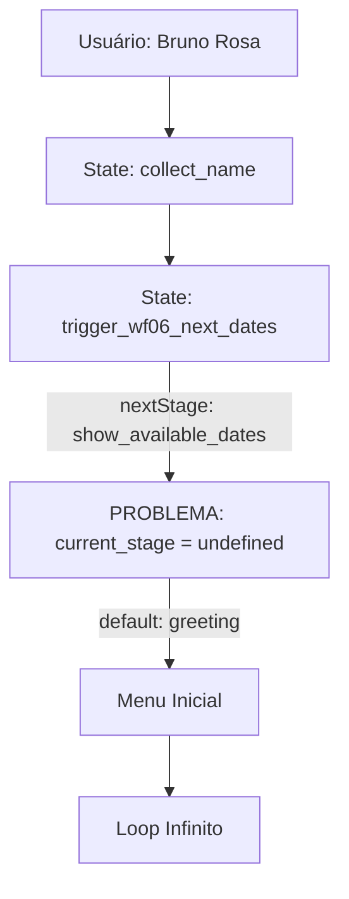

# 🚨 BUGFIX: Loop Infinito na State Machine V92

## 📋 Análise do Problema

### 🔴 Causa Raiz Identificada
O workflow V92 está entrando em loop infinito devido a uma **execução dupla da State Machine** causada pela perda do contexto `current_stage`:

1. **Primeira Execução** (State 9: `trigger_wf06_next_dates`):
   - Define `nextStage = 'show_available_dates'`
   - Retorna `responseText = ''` (vazio)

2. **Segunda Execução** (Problema):
   - `current_stage` chega como `undefined` ou vazio
   - Cai no valor default `'greeting'`
   - Vai incorretamente para `'service_selection'`
   - Loop infinito de mensagens

### 🔍 Fluxo do Problema



### 📊 Log do Comportamento Errado

```
[15:56] Usuário: "Bruno Rosa"
[15:56] Bot: "🤖 Olá! Bem-vindo à E2 Soluções!"  ← ERRO: Deveria processar nome
[15:56] Bot: "❌ Opção inválida"                 ← ERRO: Trata nome como serviço
[15:56] Bot: "🤖 Olá! Bem-vindo à E2 Soluções!"  ← LOOP
```

## 🛠️ Solução Proposta

### 1️⃣ **Preservação do Estado Entre Execuções**

#### Modificar o Node "State Machine V80":

```javascript
// ===================================================
// V93 STATE MACHINE - FIX LOOP PROBLEM
// ===================================================
// CRITICAL FIX: Preserve state between executions
// - Prevents re-execution with undefined current_stage
// - Ensures proper state flow for WF06 triggers
// Date: 2026-04-23
// Version: V93 Loop Fix
// ===================================================

// Helper functions (mantém existentes)
function formatPhoneDisplay(phone) { /* ... */ }
function getServiceName(serviceCode) { /* ... */ }

// Main execution
const input = $input.all()[0].json;
const message = (input.message || '').toString().trim().toLowerCase();

// CRITICAL FIX V93: Better state preservation
const currentStage = input.current_stage || input.next_stage || 'greeting';
const currentData = input.currentData || {};

// V93 FIX: Handle empty responseText from trigger states
const isIntermediateState = [
  'trigger_wf06_next_dates',
  'trigger_wf06_available_slots'
].includes(currentStage);

console.log('=== V93 STATE MACHINE START ===');
console.log('V93: Current stage:', currentStage);
console.log('V93: Is intermediate state:', isIntermediateState);
console.log('V93: User message:', message);
console.log('V93: Current data:', JSON.stringify(currentData));

// Initialize response variables
let responseText = '';
let nextStage = currentStage;
let updateData = {};

// V93 FIX: Skip state machine for intermediate states with empty messages
if (isIntermediateState && (!message || message === '')) {
  console.log('V93: Skipping intermediate state processing');

  // Move to the expected next state
  if (currentStage === 'trigger_wf06_next_dates') {
    nextStage = 'show_available_dates';
    responseText = ''; // Empty is OK for intermediate states
  } else if (currentStage === 'trigger_wf06_available_slots') {
    nextStage = 'show_available_slots';
    responseText = '';
  }

  // Return early to prevent re-processing
  return {
    responseText: responseText,
    nextStage: nextStage,
    updateData: updateData,
    skipUpdate: true  // V93: Signal to skip database update
  };
}

// Rest of the state machine logic...
switch (currentStage) {
  // ... (mantém todos os cases existentes)
}

// V93 FIX: Enhanced output structure
const output = {
  responseText: responseText,
  nextStage: nextStage,
  updateData: updateData,
  currentStage: currentStage,  // V93: Preserve current state
  timestamp: new Date().toISOString()
};

console.log('=== V93 STATE MACHINE END ===');
console.log('V93: Output:', JSON.stringify(output));

return output;
```

### 2️⃣ **Modificar o "Prepare Update Data" Node**

```javascript
// V93 FIX: Enhanced state preservation
const stateMachineOutput = $input.first().json;
const phoneNumber = stateMachineOutput.phone_number || stateMachineOutput.phone_with_code;

// V93 FIX: Handle intermediate states
if (stateMachineOutput.skipUpdate) {
  console.log('V93: Skipping database update for intermediate state');
  return {
    skip: true,
    phone_number: phoneNumber,
    next_stage: stateMachineOutput.nextStage
  };
}

// Prepare update data with better state preservation
const updateData = {
  ...stateMachineOutput.updateData,
  current_stage: stateMachineOutput.nextStage,  // V93: Ensure state is preserved
  last_message_at: new Date().toISOString(),
  last_processed_stage: stateMachineOutput.currentStage  // V93: Track previous stage
};

// Ensure phone_number is always present
if (!updateData.phone_number && phoneNumber) {
  updateData.phone_number = phoneNumber;
}

console.log('V93: Update data prepared:', JSON.stringify(updateData));

return {
  phone_number: phoneNumber,
  updateData: updateData
};
```

### 3️⃣ **Adicionar Node de Validação (Antes da State Machine)**

```javascript
// Node: "Validate State Context"
// Position: Between "Get Lead Data" and "State Machine V80"

const leadData = $input.first().json;
const webhookData = $input.all()[1]?.json || {};

// V93: Ensure current_stage is properly set
let current_stage = leadData.current_stage || leadData.next_stage || 'greeting';

// V93: Validate state transitions
const validStates = [
  'greeting', 'service_selection', 'collect_name',
  'collect_phone_whatsapp_confirmation', 'collect_phone_alternative',
  'collect_email', 'collect_city', 'confirmation',
  'trigger_wf06_next_dates', 'show_available_dates',
  'process_date_selection', 'trigger_wf06_available_slots',
  'show_available_slots', 'process_slot_selection',
  'schedule_confirmation', 'handoff_comercial',
  'correction_choice', 'correct_name', 'correct_phone',
  'correct_email', 'correct_city', 'correct_service'
];

if (!validStates.includes(current_stage)) {
  console.warn(`V93: Invalid state '${current_stage}', resetting to greeting`);
  current_stage = 'greeting';
}

// V93: Merge all data sources
const mergedData = {
  ...webhookData,
  ...leadData,
  current_stage: current_stage,
  currentData: leadData,  // Preserve accumulated data
  timestamp: new Date().toISOString()
};

console.log('V93: Validated state context:', {
  current_stage: current_stage,
  has_lead_data: !!leadData.lead_name,
  has_message: !!webhookData.message
});

return mergedData;
```

## 📦 Implementação no n8n

### Passo 1: Backup do Workflow Atual
```bash
cp /home/bruno/Desktop/Programas/E2_Solucoes/e2-solucoes-bot/n8n/workflows/02_ai_agent_conversation_V92.json \
   /home/bruno/Desktop/Programas/E2_Solucoes/e2-solucoes-bot/n8n/workflows/02_ai_agent_conversation_V92_backup.json
```

### Passo 2: Script de Correção
```bash
#!/bin/bash
# fix-v92-loop.sh

echo "🔧 Aplicando correção V93 para loop infinito..."

# 1. Criar novo arquivo V93
python3 << 'EOF'
import json

# Carregar V92
with open('02_ai_agent_conversation_V92.json', 'r') as f:
    workflow = json.load(f)

# Atualizar versão
workflow['name'] = '02 - AI Agent Conversation V93 (Loop Fix)'

# Encontrar e atualizar State Machine node
for node in workflow['nodes']:
    if node['name'] == 'State Machine V80':
        # Atualizar código com V93 fixes
        node['parameters']['functionCode'] = open('state_machine_v93.js', 'r').read()

    elif node['name'] == 'Prepare Update Data':
        # Atualizar para V93
        node['parameters']['jsCode'] = open('prepare_update_v93.js', 'r').read()

# Adicionar node de validação
validation_node = {
    "id": "validate-state-context",
    "name": "Validate State Context",
    "type": "n8n-nodes-base.code",
    "typeVersion": 2,
    "position": [850, 400],
    "parameters": {
        "jsCode": open('validate_state_v93.js', 'r').read()
    }
}

workflow['nodes'].append(validation_node)

# Salvar como V93
with open('02_ai_agent_conversation_V93.json', 'w') as f:
    json.dump(workflow, f, indent=2)

print("✅ V93 criado com sucesso!")
EOF

echo "✅ Correção aplicada! Teste em: http://localhost:5678/workflow/5VoOR27ygVAyTcda"
```

## 🧪 Testes de Validação

### Cenário 1: Fluxo Normal
```
1. Usuário: "oi"
   → Esperado: Menu de serviços

2. Usuário: "1"
   → Esperado: Solicita nome

3. Usuário: "Bruno Rosa"
   → Esperado: Confirma telefone WhatsApp (NÃO volta ao menu)
```

### Cenário 2: Estado Intermediário
```
1. State: trigger_wf06_next_dates
   → Esperado: Transição para show_available_dates sem re-executar
```

### Cenário 3: Recovery de Estado Perdido
```
1. current_stage = undefined
   → Esperado: Usa greeting como fallback controlado
```

## 📊 Métricas de Sucesso

- ✅ Zero loops infinitos
- ✅ Transições de estado preservadas
- ✅ Estados intermediários não causam re-execução
- ✅ Mensagens apropriadas para cada estado
- ✅ Dados do usuário preservados entre estados

## 🚀 Deploy

1. **Teste Local**: Executar workflow V93 em ambiente de desenvolvimento
2. **Validação**: Confirmar cenários de teste
3. **Deploy Produção**: Substituir V92 por V93 em produção
4. **Monitoramento**: Observar logs por 24h

## 📝 Notas Adicionais

- **Versão**: V93 (baseado em V92)
- **Data**: 2026-04-23
- **Autor**: Claude + Bruno
- **Prioridade**: 🔴 CRÍTICA - Loop infinito afetando usuários

## 🔗 Referências

- Workflow V92: http://localhost:5678/workflow/5VoOR27ygVAyTcda
- Execução com problema: http://localhost:5678/workflow/5VoOR27ygVAyTcda/executions/7600
- Log do chat com loop: [15:56, 23/04/2026]